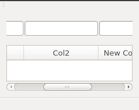

# Column Aligned Layout

This layout tracks a table's columns. It inherits from QHBoxLayout, and it
arranges its child items so that each one is exactly above a certain column.

## Usage

    alignedLayout = new ColumnAlignedLayout();
    alignedLayout->addWidget(new QLineEdit(this));
    alignedLayout->addWidget(new QLineEdit(this));
    alignedLayout->addWidget(new QLineEdit(this));
    alignedLayout->addWidget(new QLineEdit(this));
    ui->widget->setLayout(alignedLayout);
    alignedLayout->setTableColumnsToTrack(ui->tableWidget->horizontalHeader());
    alignedLayout->setParent(ui->widget);
    connect(ui->tableWidget->horizontalHeader(), SIGNAL(sectionResized(int,int,int)), SLOT(invalidateAlignedLayout()));
    connect(ui->tableWidget->horizontalScrollBar(), SIGNAL(valueChanged(int)), SLOT(invalidateAlignedLayout()));

And then in the slot call `invalidate()`:

    void MainWindow::invalidateAlignedLayout()
    {
        alignedLayout->invalidate();
    }

# New - FilteredTableWidget

There is also a sample widget called FilteredTableWidget which hosts a
QTableWidget and the line edits on top of it which was the original use-case
that prompted me to create this layout. This widget dynamically adds or removes
line edits as columns are added or removed from the table and exposes the table
and line edit widgets with public getters.
